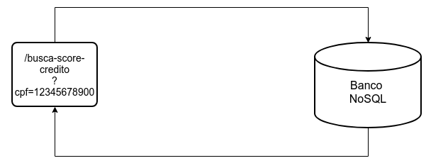

# Avaliação Financeira

Aqui será abordados como atender aos requisitos informados, sem a necessidade de ter código fonte.
Mas poderia ser desenvolvido em qualquer linguagem de backend como *Java*, *Node*, *PHP*, *Python*, etc.
Lembrando que aqui seria uma forma de resolver os problemas, não necessariamente a mais certa.
## Sumário


## Requisitos
Este teste foi baseado nos seguintes requisitos:

 **1. Armazenamento**
   
Vamos supor que existam três grandes bases de dados externas que organizam nossas informações.
A primeira delas, que chamamos de Base A, é extremamente sensível e deve ser protegida com os maiores níveis de segurança, mas o acesso a esses dados não precisa ser tão performática. 
A segunda, é a Base B que também possui dados críticos, mas ao contrário da Base A, o acesso precisa ser um pouco mais rápido. Uma outra característica da Base B é que além de consultas ela é utilizada para extração de dados por meio de algoritmos de aprendizado de máquina. 
A última base, é a Base C, que não possui nenhum tipo de dado crítico, mas precisa de um acesso extremamente rápido.


 **2. Tráfego**

Cada uma das bases existentes, são acessadas por sistemas em duas diferentes arquiteturas: microserviços e nano-serviços. Vale salientar que essas bases de dados são externas, portanto não é
necessário dissertar sobre suas implementações, apenas suas consumações. Quantos aos payloads
retornados por esses recursos, o candidato pode usar sua criatividade e definí-los, imaginando quais
dados seriam importantes de serem retornados por sistemas como esses.
O primeiro sistema, acessa os seguintes dados da Base A:

- CPF
- Nome
- Endereço
- Lista de dívidas

O segundo, acessa a Base B que contém dados para cálculo do Score de Crédito. 
O Score de Crédito é um rating utilizado por instituições de crédito (bancos, imobiliárias, etc) quando precisam analisar o risco envolvido em uma operação de crédito a uma entidade.
- Idade
- Lista de bens (Imóveis, etc)
- Fonte de renda

O último serviço, acessa a Base C e tem como principal funcionalidade, rastrear eventos relacionados a um determinado CPF.
- Última consulta do CPF em um Bureau de crédito (Serasa e outros).
- Movimentação financeira nesse CPF.
- Dados relacionados a última compra com cartao de crédito vinculado ao CPF

## Resolução

### Cenário Base A
Para este cenário seria o mais simples, criaria um micro-serviço para fazer a leitura da base, considerando aqui uma base Relacional como *Oracle*, *SqlServer*, etc., ou um banco não relacional como *MongoDB* ao qual já estaria sumarizada com os dados que fossem necessários ser retornados.
Porém antes do retorno, lançaria um evento assíncrono para poder sumarizar os dados do cenário 3 em um banco **Redis**, conforme diagrama abaixo.


Exemplo de retorno:

```json
{
    "cpf":"12345678910",
    "nome": "Fulano de Tal",
    "endereco": {
        "logradouro": "Rua esburacada",
        "numero": 171,
        "cep": "12345-678"
    },
    "dividas": [
        {
            "descricao": "Emprestimo da sogra para pagar casamento",
            "valor": 5200.00
        },
        {
            "descricao": "Financiamento Minha Casa Minha Dívida",
            "valor": 180000.00
        },
    ]
}
```

### Cenário Base B
Para este cenário primeiramente construiria uma rotina agendada (**job**) para fazer a sumarização dos dados relevantes a pontuação de crédito e inserir em uma base **MongoDb**.

Obs.: *Utilizaria esta estratégia visto que são dados que não tendem a ter modificações a todo momento.*


Após cria um micro-serviço para fazer a busca dos dados de pontuação de crédito.

Exemplo de retorno:

```json

{
    "cpf":"12345678910",
    "idade": 33,
    "bens": [
        {
            "descricao": "Veículo Marea",
            "valor": 1200.00
        },
        {
            "descricao": "Apartamento Financiado",
            "valor": 180000.00
        },
    ],
    "fontesDeRenda": [
        {
            "descricao": "Agiotagem",
            "valor": 500.00
        },
        {
            "descricao": "Malabares no semáforo",
            "valor": 1800.00
        },
    ]
}
```

### Cenário Base C

Para este cenário estou considerando que os dados financeiros serão trafegados por *WebHook's*, considerando que essa informação chegará "**online**" para o sistema.

#### WebHook consulta-realizada-cpf
Este Webhook será chamado toda vez que alguma instituição fizer alguma consulta a um determinado CPF.
Ao ser chamado irá preencher o banco **Redis** com a informação da última consulta e também preencherá um banco **MongoDb** (para garantir a informação).


#### WebHook movimentacao-financeira-realizada
Este WebHook será chamado toda vez que for realizada uma movimentação financeira para um determinado CPF, 
Ao ser chamado irá preencher o banco **Redis** com a informação da movimentação, preencherá também um banco **MongoDb** e fará uma validação, se for uma movimentação de Credito utilizando Cartão de Crédito irá preencher uma outra coleção do **MongoDb** e uma outra sessão do **Redis** para guardar esta informação.


#### Evento Realiza Sumário Financeiro
Conforme citado no cenário 1, sempre que fizer uma consulta na Base A será disparado um evento para fazer o preenchimento dos dados no banco **Redis** a partir das coleções do banco **MongoDb**. Este evento pode ser trabalhado utilizando mensageria como, por exemplo, *RabbitMq*, *ActiveMq*, *Kafka*, ou até mesmo utilizando um outro WebHook.


#### Micro-serviço busca-sumario-financeiro
Por fim terá o micro-serviço para retornar os dados sumarizados presente no **Redis**, mas caso não esteja presente irá realizar uma consulta nos dados do **MongoDb** conforme diagrama abaixo.


Exemplo de retorno

```json

{
    "ultimaConsulta": "31/10/2000",
    "idade": 33,
    "movimentacoesFinanceiras": [
        {
            "descricao": "Vaso de flores",
            "valor": 120.00,
            "local": "Floricultura Vai Tarde",
            "formaDePagamento": "Cartão",
            "data": "01/10/2020"
        },
        {
            "descricao": "Pão",
            "valor": 5.00,
            "local": "Padoka da eskina",
            "formaDePagamento": "Cartão",
            "data": "02/10/2020"
        },
        {
            "descricao": "Chiclete",
            "valor": 1.20,
            "local": "Padoka da eskina",
            "formaDePagamento": "Dinheiro",
            "data": "03/10/2020"
        }
    ],
    "ultimaCompraComCartao": {
        "descricao": "Pão",
        "valor": 5.00,
        "local": "Padoka da eskina",
        "formaDePagamento": "Cartão",
        "data": "02/10/2020"
    }
}
```

## Considerações

Estou considerando que em um processo de usabilidade do sistema, a jornada do usuário seria executar os processos na ordem das bases, ou seja, passaria pelo Cenário 1, depois Cenário 2 e por fim ao Cenário 3.

A ideia de utilizar redundância de bancos no cenário 3 é garantir performance e, também, caso os dados tenham sumidos do **Redis** por algum motivo, ou até mesmo pelo **time-to-live**, os dados sumarizados estariam no **MongoDb**.
A idéia de ter o evento é para garantir que, caso o usuário siga a jornada completa, ao chegar no cenário 3 os dados estariam preenchidos no **Redis**, garantindo o desempenho solicitado nos requisitos.
